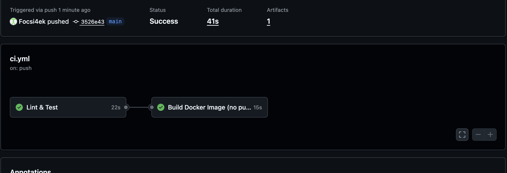
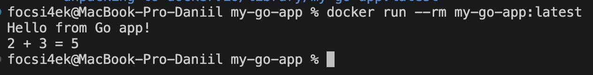

# 🐹 Go CI Pipeline with GitHub Actions

**Автор:** Абрамов Даниил Сергеевич

Учебный проект для изучения **Continuous Integration (CI)** на примере простого приложения на Go.

Проект автоматически проверяется с помощью **GitHub Actions**: выполняется статический анализ кода, запускаются автоматические тесты с формированием отчёта покрытия, сохраняется CI-артефакт и после успешного прохождения всех проверок собирается Docker-образ приложения.

---

## 🎯 Цель проекта

Основная цель проекта — настроить полноценный CI Pipeline для приложения на Go.

В рамках проекта реализованы:

- автоматический запуск CI при push
- запуск CI при Pull Request
- настройка Go-модуля
- проверка кода через golangci-lint
- запуск автоматических тестов
- расчёт покрытия кода тестами
- сохранение отчёта покрытия как GitHub Actions Artifact
- сборка Docker-образа
- локальная проверка приложения через Docker
- multi-stage Docker-сборка

---

## 🛠️ Используемые технологии

| Технология | Назначение |
|---|---|
| 🐹 Go | Основной язык приложения |
| ⚙️ GitHub Actions | Автоматизация CI |
| 🧪 Go Test | Автоматическое тестирование |
| 🔍 golangci-lint | Статический анализ Go-кода |
| 📊 Coverage | Проверка покрытия тестами |
| 🐳 Docker | Контейнеризация приложения |
| 📦 Go Modules | Управление Go-модулем |
| Git | Контроль версий |
| GitHub | Хранение исходного кода |

---

## 📁 Структура проекта

    my-go-app/
    ├── .github/
    │   └── workflows/
    │       └── ci.yml
    │
    ├── main.go
    ├── sum.go
    ├── sum_test.go
    ├── go.mod
    ├── Dockerfile
    ├── README.md
    ├── 01-github-actions-success.png
    └── 02-docker-run-success.png

---

# 🐹 Приложение

Основная точка входа находится в файле:

    main.go

Приложение выводит приветственное сообщение и результат выполнения функции сложения:

    Hello from Go app!
    2 + 3 = 5

---

## ➕ Функция Sum

Логика приложения вынесена в файл:

    sum.go

Функция принимает два целых числа и возвращает их сумму:

    func Sum(a, b int) int {
        return a + b
    }

Такое разделение позволяет отдельно тестировать бизнес-логику приложения.

---

# 🧪 Автоматические тесты

Тесты находятся в:

    sum_test.go

Для проверки используется встроенный пакет Go:

    testing

Проверяются несколько сценариев:

| Значение A | Значение B | Ожидаемый результат |
|---:|---:|---:|
| 2 | 3 | 5 |
| -1 | 1 | 0 |
| 0 | 0 | 0 |

Запуск тестов:

    go test ./...

В проекте Go установлен локально не требуется, поэтому тестирование можно выполнить через Docker:

    docker run --rm \
      -v "$(pwd):/app" \
      -w /app \
      golang:1.22-alpine \
      go test ./...

При успешной проверке отображается результат примерно следующего вида:

    ok      my-go-app

---

# 📦 Go Modules

Проект использует систему управления модулями Go.

Модуль инициализирован командой:

    go mod init my-go-app

Через Docker:

    docker run --rm \
      -v "$(pwd):/app" \
      -w /app \
      golang:1.22-alpine \
      go mod init my-go-app

В результате создаётся файл:

    go.mod

---

## 🧹 Go Mod Tidy

Для проверки и приведения зависимостей в актуальное состояние используется:

    go mod tidy

Через Docker:

    docker run --rm \
      -v "$(pwd):/app" \
      -w /app \
      golang:1.22-alpine \
      go mod tidy

В текущем проекте внешние Go-библиотеки не используются, поэтому отдельный файл `go.sum` может отсутствовать.

---

# 🔍 Статический анализ

В GitHub Actions используется:

**golangci-lint**

Он объединяет множество инструментов анализа Go-кода и позволяет автоматически находить:

- потенциальные ошибки
- проблемы со стилем
- подозрительные конструкции
- неиспользуемый код
- ошибки форматирования
- некоторые проблемы производительности

Для GitHub Actions используется:

    golangci/golangci-lint-action@v6

---

# 📊 Coverage

Тесты запускаются с формированием отчёта покрытия:

    go test -v -coverprofile=coverage.out ./...

В результате создаётся файл:

    coverage.out

Он содержит информацию о том, какая часть исходного кода была выполнена во время тестов.

---

# 📦 GitHub Actions Artifact

После тестирования файл:

    coverage.out

автоматически сохраняется как GitHub Actions Artifact.

Для этого используется:

    actions/upload-artifact@v4

Название артефакта:

    coverage-report

Благодаря этому результат тестирования сохраняется после завершения CI Pipeline и доступен на странице запуска Workflow.

---

# ⚙️ GitHub Actions

Workflow находится по пути:

    .github/workflows/ci.yml

Pipeline запускается автоматически при:

    push

и:

    pull_request

для веток:

    main
    master

---

# 🔄 CI Pipeline

Общая схема работы:

    Developer
        │
        │ git push
        ▼
    GitHub Repository
        │
        ▼
    GitHub Actions
        │
        ▼
    ┌─────────────────────────────┐
    │        Lint & Test          │
    │                             │
    │  Setup Go                   │
    │  Download Dependencies      │
    │  golangci-lint              │
    │  Go Test                    │
    │  Coverage                   │
    │  Upload Artifact            │
    └──────────────┬──────────────┘
                   │
                   │ Success
                   ▼
    ┌─────────────────────────────┐
    │     Build Docker Image      │
    │                             │
    │       my-go-app:test        │
    └──────────────┬──────────────┘
                   │
                   ▼
               ✅ Success

---

# 🚀 Этапы GitHub Actions

## 1. Checkout

GitHub Actions получает содержимое репозитория:

    actions/checkout@v4

---

## 2. Setup Go

Устанавливается Go:

    actions/setup-go@v5

Используемая версия:

    Go 1.22

---

## 3. Download Dependencies

Выполняется:

    go mod download

GitHub Actions подготавливает необходимые зависимости проекта.

---

## 4. Lint

Запускается:

    golangci-lint

Для анализа кода используется ограничение времени:

    --timeout=5m

---

## 5. Tests

Автоматически выполняются тесты:

    go test -v -coverprofile=coverage.out ./...

---

## 6. Upload Artifact

Созданный:

    coverage.out

сохраняется под именем:

    coverage-report

---

## 7. Docker Build

После успешного завершения job с тестированием запускается:

    docker build -t my-go-app:test .

---

# 🔗 Зависимость между Jobs

Docker-сборка зависит от успешного выполнения проверки и тестирования:

    needs: test

Логика выглядит так:

    Lint или Tests failed ❌
             │
             └── Docker Build не запускается

    Все проверки прошли ✅
             │
             ▼
         Docker Build

Это исключает сборку Docker-образа с кодом, который не прошёл автоматические проверки.

---

# 🐳 Docker

Проект использует **multi-stage Docker build**.

Это позволяет использовать полноценный Go-образ только для компиляции приложения, а готовый бинарный файл запускать уже в лёгком Alpine-контейнере.

---

## 🏗️ Docker Architecture

    ┌────────────────────────────┐
    │    golang:1.22-alpine      │
    │                            │
    │        Builder Stage       │
    └──────────────┬─────────────┘
                   │
                   ▼
             go build
                   │
                   ▼
               my-app
                   │
                   ▼
    ┌────────────────────────────┐
    │       alpine:latest        │
    │                            │
    │       Runtime Stage        │
    └──────────────┬─────────────┘
                   │
                   ▼
               ./my-app

---

## 🔨 Сборка Docker-образа

В корне проекта:

    docker build -t my-go-app:latest .

После успешной сборки образ можно проверить:

    docker images

---

## ▶️ Запуск Docker-контейнера

Для запуска приложения:

    docker run --rm my-go-app:latest

Результат:

    Hello from Go app!
    2 + 3 = 5

Параметр:

    --rm

автоматически удаляет контейнер после завершения работы приложения.

---

# 💻 Сборка Go-бинарника через Docker

Go необязательно устанавливать непосредственно на компьютер.

Бинарный файл можно создать через Docker:

    docker run --rm \
      -v "$(pwd):/app" \
      -w /app \
      golang:1.22-alpine \
      go build -o my-app .

После выполнения в каталоге проекта появляется:

    my-app

---

## ▶️ Запуск бинарного файла через Alpine

Поскольку бинарник создаётся внутри Linux-контейнера, на macOS безопаснее запускать его также через Docker:

    docker run --rm \
      -v "$(pwd):/app" \
      -w /app \
      alpine \
      ./my-app

Результат:

    Hello from Go app!
    2 + 3 = 5

---

# 🖥️ Результат GitHub Actions

После отправки изменений в ветку `main` GitHub Actions автоматически запускает CI Pipeline.

Все этапы были успешно выполнены:

- Lint & Test — ✅
- Docker Build — ✅
- Coverage Artifact — ✅

---

# 🐳 Результат запуска Docker

После локальной сборки образ приложения успешно запускается:

    docker run --rm my-go-app:latest

Результат:

    Hello from Go app!
    2 + 3 = 5

---

# ✅ Что проверяет CI

| Этап | Инструмент |
|---|---|
| Получение исходного кода | GitHub Checkout |
| Установка Go | setup-go |
| Загрузка зависимостей | Go Modules |
| Анализ исходного кода | golangci-lint |
| Автоматические тесты | go test |
| Покрытие тестами | coverage.out |
| Сохранение отчёта | upload-artifact |
| Сборка приложения | go build |
| Сборка Docker-образа | Docker |

---

# 📌 Continuous Integration

**Continuous Integration** — подход, при котором изменения проекта автоматически проверяются после отправки в систему контроля версий.

Разработчик выполняет:

    git push

После этого GitHub Actions самостоятельно выполняет весь Pipeline:

    Получение кода
          ↓
    Настройка Go
          ↓
    Загрузка зависимостей
          ↓
    golangci-lint
          ↓
    Go Tests
          ↓
    Coverage
          ↓
    Artifact
          ↓
    Docker Build
          ↓
        ✅ Success

---

# 🔁 Проверка новых изменений

После изменения проекта достаточно выполнить:

    git add .
    git commit -m "Update Go application"
    git push

GitHub Actions автоматически запустит новый Pipeline.

---

# 🟢 Результат CI

Успешное выполнение workflow подтверждает, что:

- Go-проект корректно собирается
- исходный код проходит статический анализ
- автоматические тесты проходят успешно
- отчёт покрытия создаётся
- CI-артефакт сохраняется
- Dockerfile корректен
- Docker-образ успешно собирается

---

# 📚 Полученные навыки

В ходе выполнения проекта были освоены:

- создание CI Pipeline для Go
- работа с GitHub Actions
- настройка Go Modules
- использование Go через Docker
- создание и запуск тестов
- использование golangci-lint
- создание отчёта покрытия
- работа с GitHub Actions Artifacts
- создание Dockerfile
- multi-stage Docker build
- компиляция Go-приложения
- запуск Go-бинарника
- сборка Docker-образа
- настройка зависимостей между GitHub Actions Jobs

---

# 🎯 Итог

В проекте создан полноценный учебный **CI Pipeline для Go-приложения**.

При каждом push GitHub Actions автоматически выполняет статический анализ, запускает тесты, формирует отчёт покрытия, сохраняет его как Artifact и после успешного прохождения проверок собирает Docker-образ.

Итоговая схема:

    Code
      ↓
    Lint
      ↓
    Tests
      ↓
    Coverage
      ↓
    Artifact
      ↓
    Docker Build
      ↓
    ✅ Success

Проект демонстрирует практический пример автоматизации проверки, тестирования и контейнеризации Go-приложения с использованием **GitHub Actions и Docker**.

---

## 👨‍💻 Автор

**Абрамов Даниил Сергеевич**

**Go CI Pipeline © 2026**